&nbsp;&nbsp;&nbsp;
&nbsp;&nbsp;&nbsp;

<!-- # Hello!
*Thanks for stopping by*. This repo serves as a kind of ever-changing portfolio of projects I'm currently excited about; please feel free to look around. -->
# To-Do
[To-Do](https://github.com/hey-sameer/todo-app) is an Android app designed to keep track of errands or tasks that need to be completed. This application will function similarly to a task manager, allowing the user to enter the tasks that they need to complete. They can also remove themselves from the list once they have completed their tasks.

It is a single activity multiple screen app where instead of fragments and nav-graphs it used compose navigation. to It offers a animated splash screen, user-authentication using Google Firebase(OneTap Signin). Besides simple crud functionality on tasks created, you can set priority levels to each task and sort them based on it. It also offers a search feature and swipe-to-delete. It also has dark mode.

Technology used: Kotlin, Compose UI Toolkit, Compose Navigation, Room Database, Dagger-Hilt

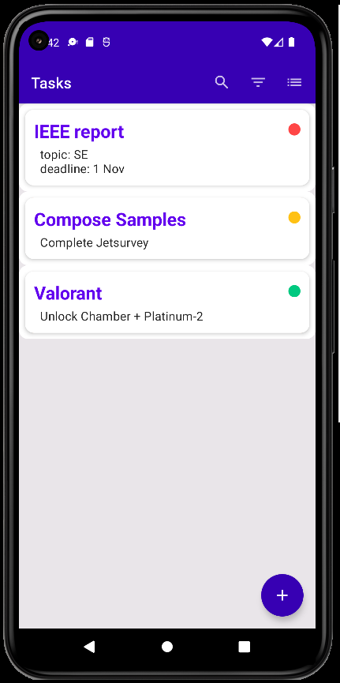&nbsp;&nbsp;&nbsp;&nbsp;&nbsp;
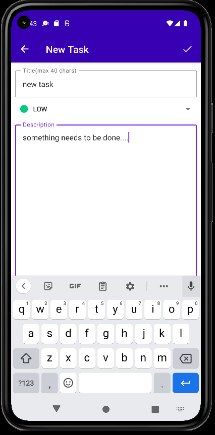&nbsp;&nbsp;&nbsp;&nbsp;&nbsp;
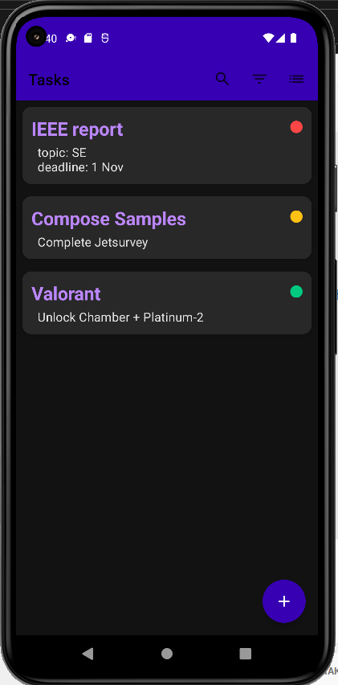 &nbsp;&nbsp;&nbsp;&nbsp;&nbsp;
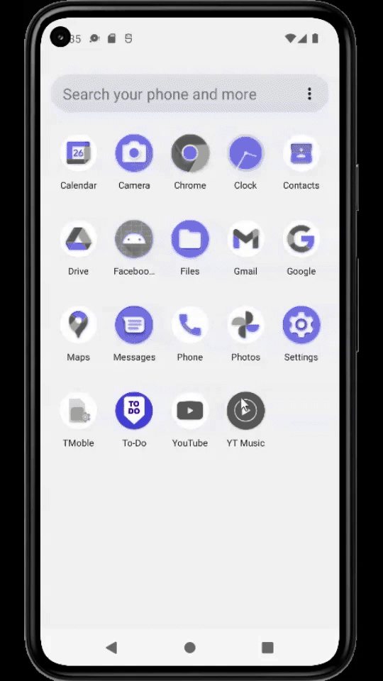&nbsp;&nbsp;&nbsp;&nbsp;&nbsp;
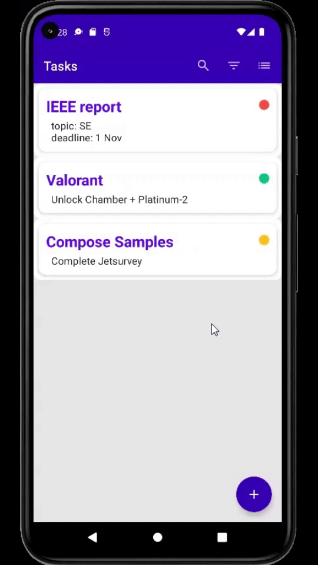

# So Cloudy
[So Cloudy](https://github.com/hey-sameer/So-Cloudy) is a self made project. It is a simple weather app that retrieves data from an [Open-Meteo's](https://open-meteo.com/en) Rest API, maps it in the proper format, and displays weather information in the UI. It gets the location coordinates from the device using <b>Fused Location Provider</b>. It also adapts to different background based on the weather and time of the day. Currently it only offers weather information of device's current location.

Technology used: Kotlin, Compose UI, Retrofit, Dagger-2, Coroutines

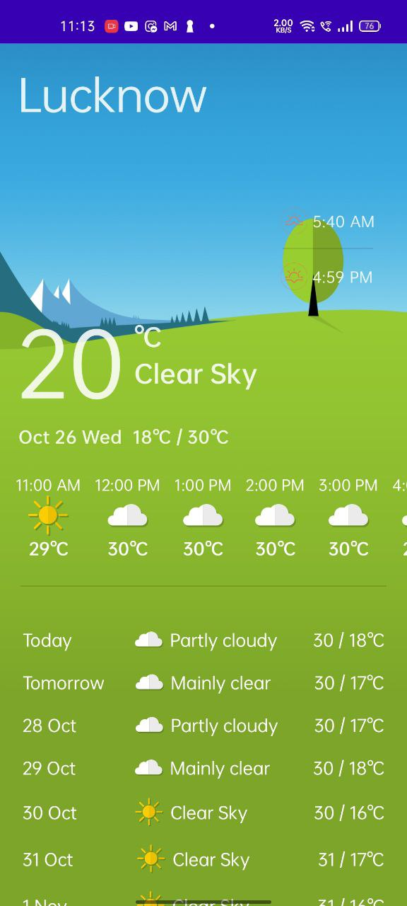&nbsp;&nbsp;&nbsp;&nbsp;&nbsp;&nbsp;&nbsp;&nbsp;
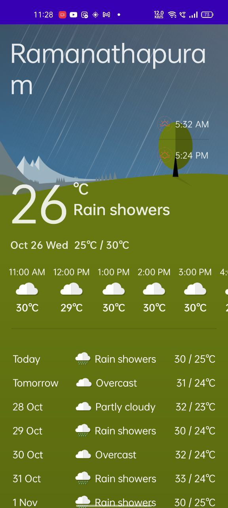&nbsp;&nbsp;&nbsp;&nbsp;&nbsp;&nbsp;&nbsp;&nbsp;
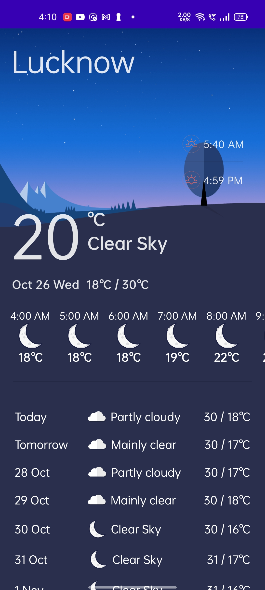&nbsp;&nbsp;&nbsp;&nbsp;&nbsp;&nbsp;&nbsp;&nbsp;
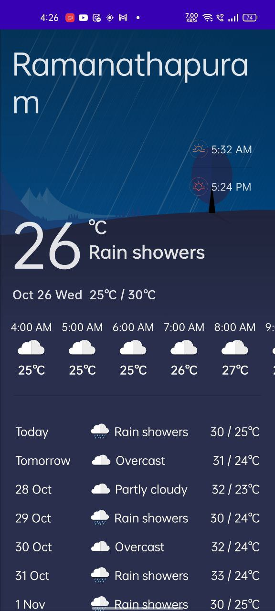&nbsp;&nbsp;&nbsp;&nbsp;&nbsp;&nbsp;&nbsp;&nbsp;
 
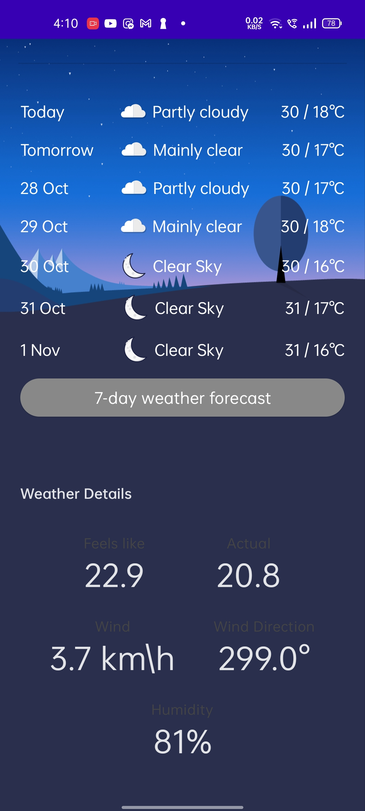&nbsp;&nbsp;&nbsp;&nbsp;&nbsp;&nbsp;&nbsp;&nbsp;
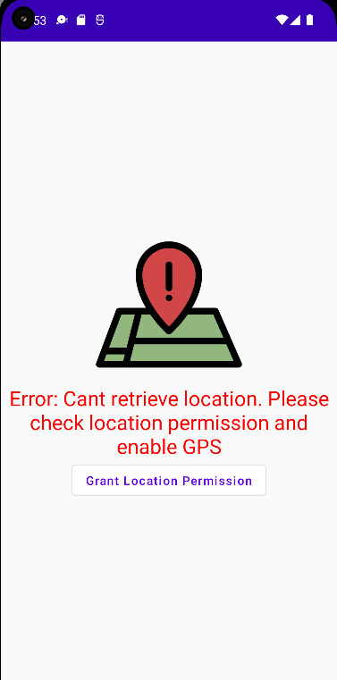&nbsp;&nbsp;&nbsp;&nbsp;&nbsp;&nbsp;&nbsp;&nbsp;
&nbsp;&nbsp;&nbsp;&nbsp;&nbsp;&nbsp;&nbsp;&nbsp;

# Facebook Clone
[Facebook Clone](https://github.com/hey-sameer/Facebook-Clone) is just a UI clone of Facebook's home page. Though it has one small working feature that is you can create text post and upload it. It would be synced via ***Firebase's Firestore*** on all devices running the app instantly. To identify the user creating the post you need to first login using Google (Fireabse Auth, think facebook using google login 🤣)

Technology used: Kotlin, Compose UI, Firebase Auth & Firestore, Coil, Coroutine, Dagger-Hilt

&nbsp;&nbsp;&nbsp;&nbsp;&nbsp;&nbsp;&nbsp;&nbsp;
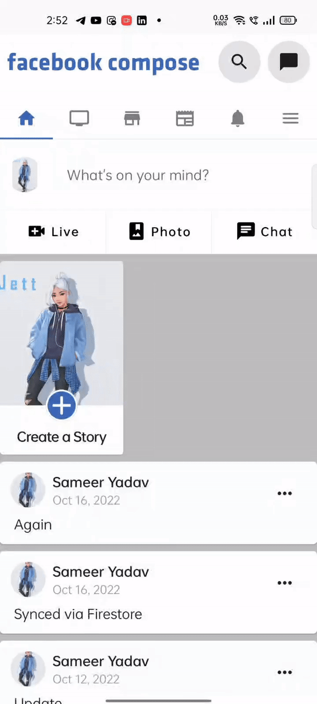&nbsp;&nbsp;&nbsp;&nbsp;&nbsp;&nbsp;&nbsp;&nbsp;

<!-- # Longboard
If you'd like to see what else I've been working on, I recommend taking a look at [**Swift CoreRestore**](https://github.com/cmilr/swift-core-restore)—a library I've recently created for adding easy Core Data **backup and restore** functionality to iOS apps. CoreRestore is a work-in-progress, but I'm proud of its simple API, light-weight nature, and the fact that it solves a problem many Swift developers experience. -->
<!-- 
You might also be interested in [**Swift DateKit**](https://github.com/cmilr/swift-datekit), my library for easily mocking dates and times in Xcode unit and UI tests. Don't be fooled by its small size—**DateKit** is a compact, highly effective set of methods and classes for testing date-critical iOS apps. -->

## Thanks for stopping by!

# Contact Info:

- Email: sameerthq2912@gmail.com
- LinkedIn: [Sameer](https://www.linkedin.com/in/sameer-yadav-061b51217/)
- Github: [hey-sameer](https://github.com/hey-sameer)
